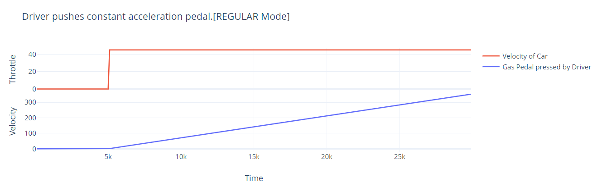
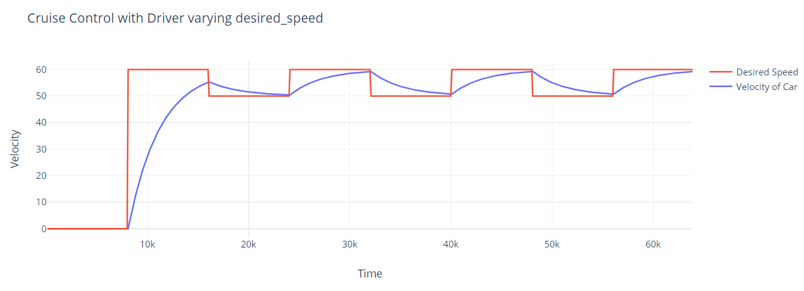
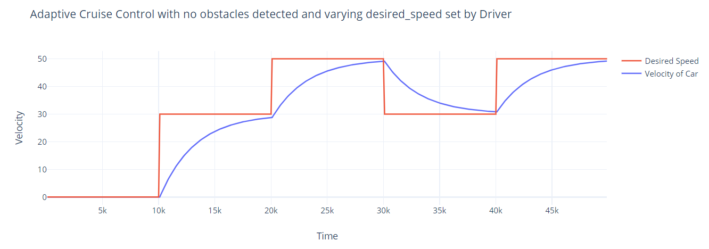
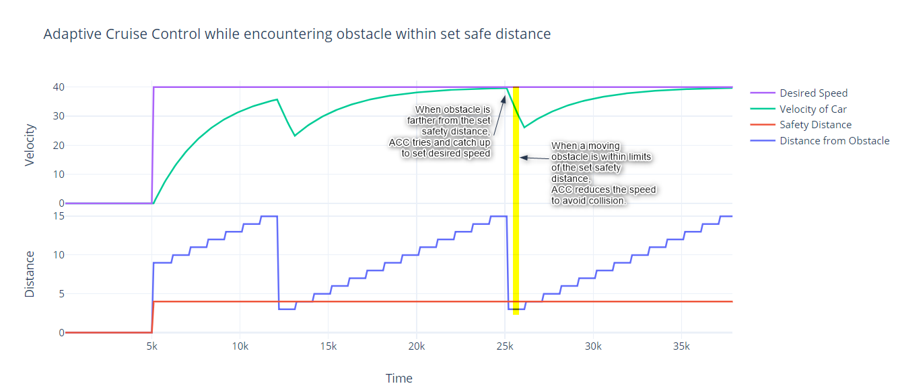

Adaptive Cruise Control based on elma
===
Scenario
---
Adaptive Cruise Control(ACC) would use the elma library to create a simulation of driving scenario. It would have a car with Adaptive Cruise Control where in the driver of the car can set the speed and safety distance for ACC. Once these parameters are set, the car runs with the set speed. In case , the driver presses the brake then the ACC gets switched off and is over ridden manually.When ACC is in operation and another car comes in the safe distance set by the driver then it tries to decrease the speed to maintain the distance from the car infront of it.

In-depth Design and Working
---

The project models a Car :car: which is equipped with Adaptive Cruise Control Capabilities and can be driven in different modes based on the driver.
The modes the Car can be driven into are as below:
- Regular Mode (`REGULAR`): `Driver` has to press acceleration pedal and Car moves in proportion to it.Default Conditions: Acceleration pedal(`accped`) is set to 15. Just for simulation.
- Cruise Control Mode (`CC`) : `Driver` has to switch on a `CC_on` switch, to put the Car into `CC` mode.Driver sets a `desired_speed` at which he would like the Car to cruise on.Default Conditions : The `desired_speed` if not set by driver while being in `CC` mode is set to 50
- Adaptive Cruise Control Mode(`ACC`): `Driver` has to switch on a `ACC_on` switch, to put the Car into `ACC` mode.Driver sets a desired_speed at which he would like the Car to cruise on and sets a safety distance `sfdist` which allows the `Car` to cruise at set `desired_speed` if no obstacle is within that distance.Default Conditions : The `desired_speed` if not set by driver while being in CC mode is set to 50 and `sfdist` is set 5.

Edge Cases:
- The Car if not exclusively set to a different mode by driver, runs in REGULAR mode.
- If both `ACC_on` and `CC_on` are switched on at the same time then, `ACC` mode is set with `ACC_on` being 1 and `CC_on` being forced to 0.

The `CruiseControl` module gets the `velocity` of `Car` and `desired_speed` set by `Driver`.If the `CC_on` is switched on,i.e; if `Car` is in `CC` mode, it computes the change in force that needs to be applied so the Car keeps moving with `desired_speed` using the proportional control law. The computed result is sent over Throttle channel

The `AutoCruiseControl` module gets activated when `ACC_on` is set by the `Driver` and the `Car` is in `ACC` mode. It gets the current `velocity` of `Car` and procures `desired_speed` and safety distance `sfdist`set by `Driver`.Also it is interrupted by `Radar` module which provides it with information about how far is the obstacle sensed is at. `ACC` module cruises on the set `desired_speed` if there are no obstacles within `sfdist` set by driver. If an obstacle is found then it decreases its speed to avoid collision and once the obstacle is no more in the safe distance range, it continues to cruise on `desired_speed`.Also as a safety feature, the `ACC` does not go below the `lowspeed` value.
A helper class module `Radar` is created which emits the obstacle distance.This has to be set by user while testing and by default the obstacle distance is set high to give a sense of no obstacles are present.

Tests
---
Some of the Test Cases from [unit_test.cc](src/unit_test.cc) are graphically shown below: 
 
**Operation in Regular Mode** 
Simulated from TestCase : RegularMode.Basic 
 

 
**Operation in Cruise Control Mode with Driver setting varying desired speed** 
Simulated from TestCase : CCMode.SimulatedDriver using a class `SimCCDriver` derived from `Driver` 
 

 
**Operation in Adaptive Cruise Control Mode without obstacles and Driver setting varying desired speed** 
Simulated from TestCase : AutoCruise.SimulatedDriver using a class `SimACCDriver` derived from `Driver` 
 

 
**Operation in Adaptive Cruise Control Mode with one set desired_speed and interaction with moving obstacles** 
Simulated from TestCase : AutoCruise.ObstacleDetection using a class  `Driver` and class `Obstacle` derived from class `Radar` 
 

 

Design Details/Working(Added on 3/17):
---
- Cruise Control is being redesigned.
    - Driver sets Cruise On/Off which is emitted as an event to CruiseControl class
    - When CC is switched on , the driver also sets the desired speed which is sent over the channel.
    - CruiseControl class has an handler for change in `CC_on`
    - CruiseControl class sets the value of throttle accordingly and sends it over channel to the Car class.
    - Car class, depending on the current velocity of the car and new throttle value, sets the new speed of the car.
- Adaptive Cruise Control is designed in the class `AutoCruiseControl`.
    - Driver switches on `ACC_on` switch to enable Adaptive Cruise Control to kick in.This triggers an event.
    - When ACC is switched on, Driver has to set desired speed and safety distance.
    - In AutoCruiseControl class, depending on `ACC status` event, the desired speed, safety distance and current velocity of Car is read in.
    - In addition to this, ACC is being catered to by another class called Radar inherited from Process.
        Radar sends the distance from the car to the next obstacle.
    - In ACC, if obstacle is farther than safety distance, the ACC keeps cruising at the same desired speed set by the driver.
    - If ACC finds that obstacle is in the range of safety distance set, in order to prevent damage, it decreases the desired speed in proportion to the distance between obstacle and safe distance of Car, until it can maintain the safe distance from the obstacle.  

    Assumptions:  
    The obstacle is also contsantly moving wrt to car either at slow speed or higher speed than that of ACC car.

Implementation Details
---
- Car would be inherited by a process class

- Cruise Control would be inherited by a process class

- Adaptive Cruise Control would be inherited either by Cruise Control/Process(Design choice).

    It will set Adaptive Cruise control speed depending on 
    - speed set by driver
    - another car/obstacle in the safety distance

- Driver would be inherited by process class with below operations in scope
    - set speed
    - set safety distance
    - set the Car into different Modes

Milestones 
---
1. Talk to Professor about the project and it's feasibility. Date : 03/09 -DONE
2. Create ACC class and share events between driver, car and ACC. Date : 03/13 
    DONE : 
        - 3/15 : Cruise Control is modified/ Simulated Time run is created 
        - 3/16 : Different Classes for CC and ACC. Driver Class is modified to accomodate different driving styles.
3. Create driving environment where another interacts with car enabled with ACC. Date : 03/17 
    DONE :  
        - 3/17 : Tested the driving scenarios using the environment. 
        - 3/19 : Modularise ACC example with different classes in different files. 
        - 3/19 : Adapt to ELMA project Folder structure.  
        - 3/20 : Check the new pull for Simulated Run and compare with existing one.  

4. Write the test cases and get the testing done.  
    DONE: 
        - 03/20 : Multiple Test cases have been written.
            - Checks Regular , CC and ACC mode separately
            - Checks transistion from one mode to other.
            - Checks CC with change in desired speed set by driver
            - Checks ACC with chanage in desired speed set by driver
            - Checks ACC with change in desired safety distance set by driver
            - Checks ACC with combination of change in desired speed and safety distance
            - Created a simulation of obstacle to check ACC speed decrease in case of obstacle detection.

5. Submit documentation with tests. Date : 03/22 - DONE

Strech Goals
---
1. Interaction of car enabled with ACC with a regular car. 
    DONE: Interaction of ACC enabled car with moving obstacle is met. Obstacle is modelled as a part of Radar capabilities.
2. Car with Camera function and not ACC. - which could read sign boards and change the speed of car dynamically till driver intervenes.
    - Dealt with 3 cases and did not venture into Car with Camera.
3. Simulation of Car with respect to ACC enabled Car.
    - DONE(Partially) : Modified it to deal ACC enabled car with any moving obstacle, havent modelled obstacle exactly as a car. But could be perceived as one. See Test Cases.
4. Plot of distance covered by regular car vs the distance covered by ACC enabled car wrt time.(depicting its speed curve)
    - Provided
5. [3/17] Consider having a UI using ncurses.
    - Started working on it but felt many things have to be modelled for the display.

Installation
---

The source code for Elma [is on Github](https://github.com/klavinslab/elma).
Also forked in this project.
It is being directly used with help of docker as shown below.

From Dockerhub
---

To get started, you will need a C++ build environment. The Docker container `elma` is available on Dockerhub, which can be used as follows:

    git clone https://github.com/AnushaKamat/AdaptiveCruiseControl.git
    cd AdaptiveCruiseControl
    docker run -v $PWD:/source -it klavins/elma:latest bash
    make
    ./bin/Regular 
    ./bin/test     

References
---
The example of Adaptive Cruise Control is mainly built on [elma](https://github.com/klavinslab/elma) library using following references:
- [gcc](https://gcc.gnu.org/)
- [Doxygen](http://www.doxygen.nl/)
- [Google Test](https://github.com/google/googletest)
- Neils Lohmann's JSON library: https://github.com/nlohmann/json
- [yhirose](https://github.com/yhirose)'s HTTP library
- Docker Image [klavins/ecep520](https://hub.docker.com/r/klavins/ecep520)

License
---
This software is open source and uses the MIT license. Details can be found [here](https://github.com/klavinslab/elma).
